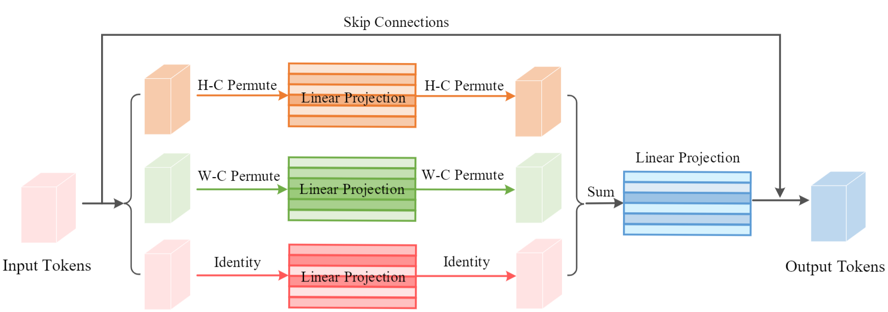

# Vision Permutator: A Permutable MLP-Like Architecture for Visual Recognition

This is a Pytorch implementation of our paper. We present Vision Permutator, a conceptually simple and data efficient
MLP-like architecture for visual recognition. We show that our Vision Permutators are formidable competitors to convolutional neural
networks (CNNs) and vision transformers. 

Vision Permutator achieves 81.6% top-1 accuracy on ImageNet without
extra large-scale training data (e.g., ImageNet-22k) using only 25M learnable parameters.
When scaled up to 88M, we attain 83.2% top-1 accuracy.

We hope this work could encourage researchers to rethink the way of encoding spatial
information and facilitate the development of MLP-like models.



Basic structure of the proposed Permute-MLP layer. The proposed Permute-MLP layer contains
three branches that are responsible for encoding features along the height, width, and channel
dimensions, respectively. The outputs from the three branches are then combined using element-wise addition, followed by a fully-connected layer for feature fusion.

Our codes are based on the [pytorch-image-models](https://github.com/rwightman/pytorch-image-models) and [Token Labeling](https://github.com/zihangJiang/TokenLabelinghttps://github.com/rwightman).

### Comparison with Recent MLP-like Models

| Model                | Parameters | Throughput | Image resolution | Top 1 Acc. | Download |
| :------------------- | :--------- | :--------- | :--------------- | :--------- | :------- |
| EAMLP-14             | 30M        | 711 img/s  |       224        |  78.9%     |          |
| gMLP-S               | 20M        | -          |       224        |  79.6%     |          |
| ResMLP-S24           | 30M        | 715 img/s  |       224        |  79.4%     |          |
| ViP-Small/7 (ours)   | 25M        | 719 img/s  |       224        |  81.6%     | [link]() |
| EAMLP-19             | 55M        | 464 img/s  |       224        |  79.4%     |          |
| Mixer-B/16           | 59M        | -          |       224        |  78.5%     |          |
| ViP-Medium/7 (ours)  | 55M        | 418 img/s  |       224        |  82.7%     | [link]() |
| gMLP-B               | 73M        | -          |       224        |  81.6%     |          |
| ResMLP-B24           | 116M       | 231 img/s  |       224        |  81.0%     |          |
| ViP-Large/7          | 88M        | 298 img/s  |       224        |  83.2%     | [link]() |

The throughput is measured on a single machine with V100 GPU (32GB) with batch size set to 32.

### Requirements

torch>=1.4.0
torchvision>=0.5.0
pyyaml
scipy
timm==0.4.5

data prepare: ImageNet with the following folder structure, you can extract imagenet by this [script](https://gist.github.com/BIGBALLON/8a71d225eff18d88e469e6ea9b39cef4).

```
│imagenet/
├──train/
│  ├── n01440764
│  │   ├── n01440764_10026.JPEG
│  │   ├── n01440764_10027.JPEG
│  │   ├── ......
│  ├── ......
├──val/
│  ├── n01440764
│  │   ├── ILSVRC2012_val_00000293.JPEG
│  │   ├── ILSVRC2012_val_00002138.JPEG
│  │   ├── ......
│  ├── ......
```

### Validation
Replace DATA_DIR with your imagenet validation set path and MODEL_DIR with the checkpoint path
```
CUDA_VISIBLE_DEVICES=0 bash eval.sh /path/to/imagenet/val /path/to/checkpoint
```

### Training

Train the : 

If only 4 GPUs are available,

```
CUDA_VISIBLE_DEVICES=0,1,2,3 ./distributed_train.sh 4 /path/to/imagenet --model lvvit_s -b 256 --apex-amp --img-size 224 --drop-path 0.1 --token-label --token-label-data /path/to/label_data --token-label-size 14 --model-ema
```

If 8 GPUs are available: 
```
CUDA_VISIBLE_DEVICES=0,1,2,3,4,5,6,7 ./distributed_train.sh 8 /path/to/imagenet --model lvvit_s -b 128 --apex-amp --img-size 224 --drop-path 0.1 --token-label --token-label-data /path/to/label_data --token-label-size 14 --model-ema
```


Train the LV-ViT-M and LV-ViT-L (run on 8 GPUs):


```
CUDA_VISIBLE_DEVICES=0,1,2,3,4,5,6,7 ./distributed_train.sh 8 /path/to/imagenet --model lvvit_m -b 128 --apex-amp --img-size 224 --drop-path 0.2 --token-label --token-label-data /path/to/label_data --token-label-size 14 --model-ema
```
```
CUDA_VISIBLE_DEVICES=0,1,2,3,4,5,6,7 ./distributed_train.sh 8 /path/to/imagenet --model lvvit_l -b 128 --lr 1.e-3 --aa rand-n3-m9-mstd0.5-inc1 --apex-amp --img-size 224 --drop-path 0.3 --token-label --token-label-data /path/to/label_data --token-label-size 14 --model-ema
```
If you want to train our LV-ViT on images with 384x384 resolution, please use `--img-size 384 --token-label-size 24`.


#### Reference
If you use this repo or find it useful, please consider citing:
```
@article{jiang2021all,
  title={All Tokens Matter: Token Labeling for Training Better Vision Transformers},
  author={Jiang, Zihang and Hou, Qibin and Yuan, Li and Zhou, Daquan and Shi, Yujun and Jin, Xiaojie and Wang, Anran and Feng, Jiashi},
  journal={arXiv preprint arXiv:2104.10858},
  year={2021}
}
```
